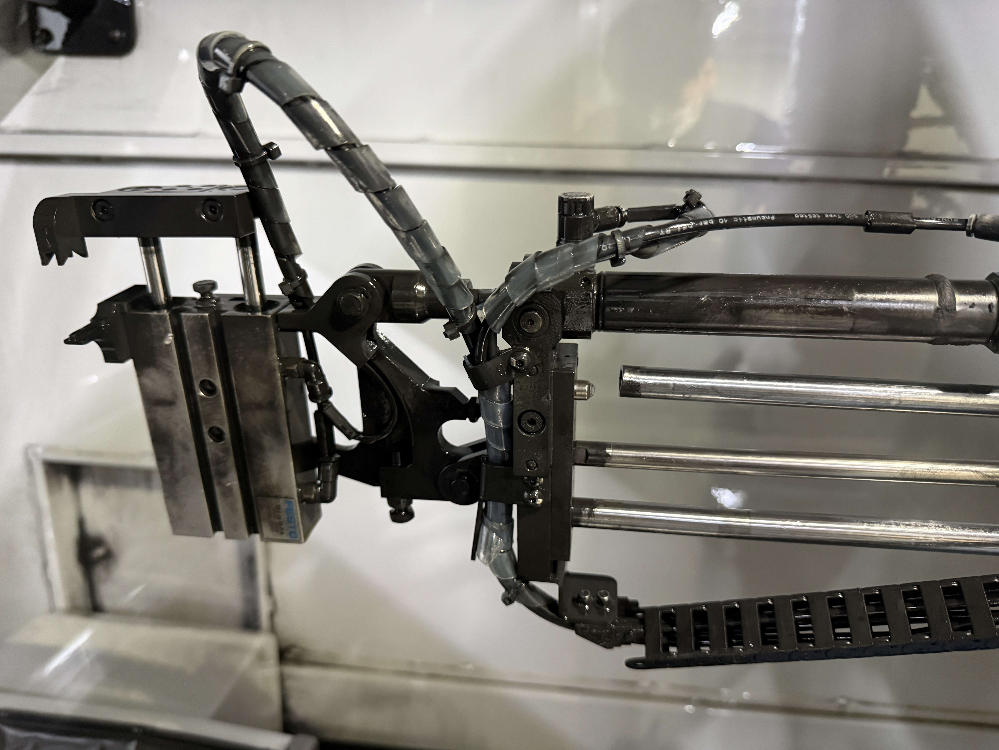

# F 장비(FastGrind) 로더 유압실린더 파손 (2026-08-11)

> ✅ **2026-08-13 임시조치 완료** — 사설업체 "에이원" 현장 방문(오늘 17:00 이후) 결과, 실린더 파이프가 휘어 정상 삽입되지 않는 상태로 확인됨. 파이프 분해·조정 후 1개만 끼운 상태로 삽입되도록 간이 작업, 케이블타이로 고정하여 로더를 고정·마무리 — **F 장비 가동 재개**. 정식 수리(부품 구매 + ANCA 서비스)는 추후 진행 예정(§2·§5·§6 참조). ANCA 견적(QKR3322)은 계속 보류 상태.
>
> ✅ **2026-08-14 ANCA 정식수리 공식 발주 완료** — 한경준님 확인: 대표님 결재 승인 후 **ANCA 서비스에 정식 수리(부품구매+장착)를 공식 의뢰, 부품 발주를 완료**함. F+GX7 공용 견적(QKR3322, §2 항목9·§5.4 참조)에 따라 GX7 실린더 교체도 이번 발주에 함께 포함됨([[repairs/gx7-로더-사용금지-2026-08-13]] 참조). 부품 입고까지 약 1개월 예상(§2 항목17 리드타임 추정 유지). 정확한 입고일·착수일은 확인 필요. 상세는 §2 항목19·§6 참조.

## 1. 사고 개요

| 항목 | 내용 |
|------|------|
| 발생일시 | 2026-08-11(화) 11:45경 |
| 장비 | F 장비 (FastGrind, ANCA CNC Tool Grinder) — [[anca-cnc-tool-grinder]] |
| 작업 내용 | 로더(Loader) 자동 이송 중 2번 제품을 파레트(Pallet)와 함께 이송 |
| 증상 | 파레트와 제품이 분리되지 않고 함께 끌려감 → 강제 분리 조치 중 유압실린더(Hydraulic Cylinder) 최상단 1번 실린더의 **실린더 봉(피스톤 로드) 파손**(사진 확인, 아래 §10 참조). ⚠️ 부품 계열(유압/공압)은 여전히 확인 필요 — 실제 발주된 ANCA 견적서(QKR3322) 품목은 `CYLINDER SMC MGPM20-200A-SP`로, SMC MGP 시리즈는 통상 **공압(에어) 가이드실린더** 계열임. ✅ **2026-08-13 현장 확인(실측)**: 에이원 점검 결과 **실린더 파이프가 휘어 정상 위치로 삽입되지 않는 상태**로 확인됨(§2·§4 참조) |
| 발견 당시 상태 | 로더가 이미 꺾여 있는 상태로 확인됨. ✅ **PLC 로그 확인(실측 검증, §3 참조)**: 11:34:44부터 Loader arm IN/OUT position 미체결 경보가 반복되다 11:45:54 비상정지 — "선행 이상 발생 시점 불명"이었던 부분이 로그로 특정됨(약 11분 선행) |
| 현재 상태 | ✅ **임시조치 완료, 가동 재개(2026-08-13)** — 에이원이 실린더 파이프를 분해·조정 후 1개만 끼운 상태로 삽입되도록 간이 작업, 케이블타이로 고정하여 로더 고정·마무리. F 장비는 이 간이 조치 상태로 가동 중. **✅ 2026-08-14 ANCA 정식수리 공식 발주 완료** — 부품구매+장착 정식 의뢰, F+GX7 공용 부품 발주 완료(입고 대기, 리드타임 약 1개월 예상) — 정확한 착수일은 확인 필요 |

## 2. 경과 (시간 순)

1. 11:45경 — 로더가 2번 제품을 파레트와 함께 이송하던 중 이상 발생(파레트·제품이 분리되지 않고 함께 끌려감).
2. 끌려가는 상태를 강제로 분리 조치.
3. 분리 과정 중 유압실린더 가장 상위(1번)의 **실린더 봉(피스톤 로드)** 파손 확인(휘어짐/절손, 사진 확인).
4. 확인 시점에 로더가 이미 꺾여 있는 상태였음 — 정상적으로(사고 전에) 분리돼 있던 것인지, 이번 파손으로 꺾인 것인지 육안으로 구분 불가. 현장에서 직접 위치를 맞춰 복원 시도했으나 실패.
5. ANCA 정비 직원에게 파손 부위 사진을 첨부해 문의.
6. ANCA 측 1차 소견 — 유압실린더 파손으로 판단, 수리 필요.
7. **수리 요청 완료** — 견적서(비용) 및 수리 소요기간(부품 수급·작업 기간) 둘 다 회신 대기 중. 수령 시 별도 보고 및 이 기록에 반영 예정.
8. **발주서 작성(2026-08-11)** — 코고툴(주) → 안카코리아(성훈상사) 앞 발주서 발송. 메모사항: "FAST 로더 실린더 부품, 장비 점검 요청"(원본: `raw/CNC 정보/코고툴 260811 서비스 발주.pdf`).
9. **ANCA 견적서 수령(2026-08-12)** — 견적번호 QKR3322, 품목 `CYLINDER SMC MGPM20-200A-SP` 2 EA. 견적 유효기간 2026-09-11까지(원본: `raw/CNC 정보/CNC 수리/로더 실린더 교체/Cogo Tool_QKR3322.pdf`). 금액: 대외비 — 원본 견적서 참조. **✅ 2026-08-13 정정 확인(한경준님)**: 이 2EA는 F 장비 1개 + GX7(G 장비) 1개로, **F+GX7 공용 견적**임을 확인 — GX7용 별도 견적은 불필요(§4 원인, `repairs/gx7-로더-사용금지-2026-08-13.md` §4 참조).
10. **부품 리드타임 구두 확인(2026-08-12, 한경준님)** — 약 1~2개월 예상. ⚠️ 견적서 자체에는 배송/리드타임이 명시돼 있지 않아, 확정치가 아닌 현장 구두 추정치임(사내 경험값).
11. **현장 방문 확인 예정(2026-08-12 결정)** — 다음주(2026-08-17 주, 정확한 요일 확인 필요) 실제 현장 방문을 통해 남은 확인 필요 항목(부품 유압/공압 계열, 정확한 파손 원인, 부분수리 vs 전체교체, 정확한 리드타임)을 그때 확정하기로 함. 방문 주체(ANCA 정비 측으로 추정)는 확인 필요.
12. **ANCA 진단덤프(Machine SN 750534) 확보 및 분석(2026-08-12)** — F 장비에서 캡처한 전체 진단덤프(`raw/CNC 정보/CNC 수리/로더 실린더 교체/ANCA_Diagnostic_750534_20260812.zip`)를 확보해 PLC 에러로그(`ErrorLog.epl`)를 분석, 사고 전후 정밀 타임라인과 알람 코드를 확인함 — 상세는 아래 §3 참조.
13. **수리 진행 여부 검토보고서 작성 및 대표님 결재요청 전달(2026-08-12)** — 원인 규명(그립 부정확 가설 포함)·수리 필요성(로더 기반 병행업무 근거)·사용량(F 44개/일·G 27.75개/일 실측)·장비 의의를 종합해 Word 문서(`F장비_로더실린더_수리진행_검토보고_20260812.docx`, 한경준님 보관)로 작성. 실제 견적금액(부품비)은 결재 보고서 내부에만 기재하고 위키에는 기록하지 않음(CLAUDE.md §4 대외비 원칙, 위키 공개 배포 감안). 상세 근거는 아래 §5 참조.
14. **현장 확인 일정 변경 및 업체 전환(2026-08-13)** — 다음주(08-17 주) 예정이었던 ANCA 현장 방문을 취소하고, **오늘(2026-08-13) 오후 5시(17:00) 이후** 사설 업체 **"에이원"**이 현장을 방문하기로 확정(한경준님 확인, 2026-08-13). ANCA 견적서(QKR3322)에 따른 발주는 보류 — 에이원의 진단·견적 결과를 보고 재개 여부 결정. ⚠️ 업체 전환 사유(비용·소요기간 등)는 확인 필요였으나, 아래 §5.4 시간당 공임 비교(금액은 대외비, §5.4 참조)가 관련 있을 가능성 있음(단, 한경준님이 이를 전환 사유로 명시적으로 확인한 것은 아니므로 확정하지 않음).
15. **에이원 현장 방문·진단·임시조치 완료(2026-08-13)** — 에이원 점검 결과 **실린더 파이프가 휘어 정상 위치로 삽입되지 않는 상태**로 확인됨(§4 원인에 반영). 이에 실린더 파이프를 분해 후 조정, **1개만 끼운 상태로 삽입되도록 간이 작업** 진행, **케이블타이로 고정**하여 로더를 고정·마무리 — 작업 완료. F 장비는 이 임시조치 상태로 **가동 재개**. **차후 계획**: 정식 부품 구매 + ANCA 서비스로 본 수리 진행 예정(일정 미확정). 시간당 공임 확인: ANCA·에이원 양쪽 확인(금액은 대외비, §5.4 참조).
16. **정식 수리를 ANCA 경유로 진행해야 하는 사유 확인(2026-08-13)** — ANCA(안카코리아)가 다음과 같은 공식 방침을 근거로 자체/외부 업체를 통한 부품 장착에는 품질 보증을 제공하지 않는다고 확인함: "당사(안카코리아) 소속 공인 엔지니어가 직접 검수 및 장착을 수행하지 않고, 고객사 자체 인력 또는 외부 업체를 통해 교체·장착된 스페어 파츠에 대해서는 제품의 물리적 결함 외에 오장착, 부적절한 취급 등으로 발생하는 오작동 및 고장에 대해 당사는 품질 보증(Warranty)을 제공하지 않습니다."(안카코리아, 2026-08-13, [신뢰도: 제조사 기준]). 즉 에이원의 임시조치는 어디까지나 긴급 임시방편이며, **정식 수리(부품 구매+장착)는 향후 보증 유지를 위해 반드시 ANCA를 통해 진행**해야 함이 확인됨.
17. **부품 리드타임 재확인(2026-08-13)** — 부품 자체 재고가 없어 약 1개월 예상(한경준님 확인, [신뢰도: 사내 경험값]). 기존 2026-08-12 구두 추정(약 1~2개월)과 함께 병기 — 정식 발주 시 정확한 리드타임 재확정 필요.
18. **임시조치 내구성에 대한 자체 판단(2026-08-13, 한경준님)** — 케이블타이 고정 임시조치가 약 2~3개월 정도는 버틸 것으로 판단됨. ⚠️ 에이원이 명시적으로 이 기간을 확인해 준 것은 아니며, 한경준님의 현장 경험에 기반한 판단임 [신뢰도: 추정값]. 정식 수리 예상 리드타임(약 1개월, 항목17)보다는 여유가 있는 편이나, 확정된 안전 마진이 아니므로 임시조치 상태 동안 지속 모니터링 권장(§8 참조).
19. **✅ ANCA 정식수리 공식 발주 완료(2026-08-14, 한경준님 확인)** — 대표님 결재 승인 후 **ANCA 서비스에 정식 수리(부품구매+장착)를 공식 의뢰하여 부품 발주를 완료**함. F+GX7 공용 견적(QKR3322, 항목9 참조)에 따라 이번 발주에 GX7 실린더 교체도 함께 포함됨([[repairs/gx7-로더-사용금지-2026-08-13]] §2 참조). ⚠️ **확인 필요**: 정확한 발주일·주문번호, 확정 리드타임(항목17의 약 1개월 추정과 별개로 실제 발주 시점 기준 재확인 필요), 정확한 착수·입고 예정일. 대표님 결재 승인 경위(결재 완료 시점·결재 문서)도 이번 챗 보고에는 포함되지 않아 확인 필요로 남김.

## 3. PLC 에러로그 분석 (실측 검증 — ANCA 진단덤프, 2026-08-12 캡처)

> 신뢰도: **실측 검증** — F 장비 CNC 컨트롤러가 자체 기록한 `ErrorLog.epl` 원본 로그 기준. 사람의 기억이 아닌 기계 기록이므로 아래 시각·알람코드는 확정값으로 취급 가능(단, 알람의 근본 기계적 원인은 여전히 현장 확인 필요).

### 3.1 장비 식별 정보

| 항목 | 값 |
|------|-----|
| Machine SN | 750534 |
| CNC SN | 165-1329-0229 |
| Variant | rx7.5dx.fg.clx (`fg` = FastGrind) |
| Platform | 946-4-03-0600 |
| AMCore 버전 | 1.4.0340 (Release RN32.1-1, Patch 79.02) |
| OS | Windows XP SP3 |

### 3.2 정밀 타임라인 (2026-08-11)

| 시각 | 이벤트 | 알람코드 |
|------|--------|---------|
| 11:25:35 | loadermate(로더 제어 소프트웨어) 시작 | - |
| 11:27:01 | igrind 시작 | - |
| 11:34:12 | 프로브가 공구를 인식 못함(경고) — 이번 사고와 무관한 것으로 보임 | - |
| 11:34:40 | Wrist_AB startup 경고 — Position A DOWN 미체결 | ALM 2161 |
| **11:34:44** | **Loader arm timeout — Arm IN position 미체결(피드백 IPB407 확인 요망)** | **ALM 1174** |
| 11:39:59 | Loader arm startup — Arm IN position 미체결 | ALM 1176 |
| 11:42:49~11:43:42 | Wrist AB Warning(전원 인가 시 Wrist AB down) 4회 반복 | ALM 2624 |
| 11:43:58 | Loader arm timeout — Arm OUT position 미체결(피드백 IPB417 확인 요망) | ALM 1175 |
| **11:45:54** | **비상정지(운전반 E-Stop) 발생** — 기존 기록 "11:45경"과 정확히 일치 | ALM 0105 |
| 11:52~11:56 | Loader arm IN/OUT 타임아웃·startup 경보 및 비상정지 반복(약 5회) | ALM 1174/1175/1176, 0105 |
| 13:05, 13:40~13:41 | 동일 계열 경보 재발(복구 시도로 추정) | ALM 1174/1175/1176, 0105 |
| 14:27~14:41 | 동일 계열 경보 다수 반복 | ALM 1174/1175/1176 |
| **15:46:15** | 비상정지 재발 | ALM 0105 |
| 15:46:28 | AMCore Shutdown 발생 | - |
| **15:46:32** | AMCore 완전 정지 — 이후 로그 공백(당일 조치 종료로 추정) | - |

### 3.3 2026-08-12 재기동 및 진단 캡처

| 시각 | 이벤트 | 알람코드 |
|------|--------|---------|
| 13:57:37 | 기기 재기동 — CNC 릴리즈 정보 재확인(3.1 표와 동일) | - |
| 13:58:07~13:58:58 | SERCOS Phase 0~4 정상 초기화, 각 축(X/Y/Z/A/C/스핀들) 정상 인식, igrind 재시작 | - |
| 14:34:17, 14:34:20 | Grinder Z axis dead stop(재기동 후 초기 상태로 추정) | ALM 0126 |
| 14:34:43~14:35:42 | Wrist AB Warning 재발(재기동 후 원점복귀 필요 상태, 08-11과 동일 계열) | ALM 2624 |
| **15:39:44** | 이 진단덤프(Machine SN 750534) 캡처 시점 | - |

### 3.4 유압/공압 판단 참고 정황 (확정 아님)

- PLC 태그 구조(`rx7_core.xrf`) 확인 결과, 로더 암 IN/OUT 제어는 **솔레노이드 출력**(`OPB_ARM_IN_SOLENOID`, `OPB_ARM_OUT_SOLENOID`) + **리밋스위치 입력**(`IPB_ARM_OUT_SWITCH` 등) 조합으로 구성됨 — 이는 단순 ON/OFF 방식의 **공압 실린더 제어**에 흔히 쓰이는 전형적 구조.
- 이 장비에는 별도의 **유압펌프 계열 태그**(`GPB_HYDRAULIC_PUMP`, `GPB_HYDRAULIC_STEADY_FITTED` 등)도 존재하나, 이름상 **스테디레스트(방진구) 등 다른 용도**로 보이며 로더 암 회로와는 별개 시스템으로 추정됨.
- ⚠️ 위 내용은 PLC 코드 구조상 정황 증거이며, **로더 암 실린더가 실제로 공압인지 확정하는 근거는 아님** — 다음주 현장 방문 시 실물 확인 필요(§4·§8 참조). 다만 이번에 발주한 SMC 공압 가이드실린더(§9 참조)와는 구조적으로 모순되지 않음.

### 3.5 해석 시 주의사항

- 이 로그는 **"Arm IN/OUT 위치 스위치가 정상 체결되지 않는다"는 사실만 알려줄 뿐, 실린더 봉이 휘거나 부러진 것이 원인인지, 리밋스위치 자체 불량인지, 배선 문제인지는 구분하지 못함** — 정밀 원인은 여전히 §4 "원인" 및 다음주 현장 확인 사항.
- 11:34:44(최초 Arm IN 경보)부터 11:45:54(비상정지)까지 **약 11분간 이미 이상 징후가 반복**되고 있었음 — 즉 "11:45경 갑자기 사고 발생"이 아니라, 11:34경부터 로더 암이 정상 위치에 체결되지 않는 상태가 진행 중이었고 11:45:54에 운전자가 비상정지를 눌러 상황을 확인한 것으로 재구성됨. **✅ 업데이트(2026-08-12)**: 한경준님의 "그립 부정확으로 파레트가 끌려왔다" 가설(§4 참조)과 결합하면, 이 11분은 "실린더 노후화의 점진적 징후"가 아니라 "그립 오류로 파레트가 끌리는 상태에서 암이 반복적으로 IN 위치 진입을 시도·실패한 구간"으로 재해석 가능 — 이 경우 노후화 없이도 "정상 사용 중 갑작스러운 파손"과 앞뒤가 맞아, 애초의 배치 문제가 해소될 수 있음(다만 가설 단계, 확인 필요).

## 4. 원인 (현재까지 확인된 범위)

⚠️ **정밀 원인 미확정** — ANCA 정비 측의 정밀 진단(견적서 포함) 결과가 나오는 대로 갱신 필요. PLC 로그 기반 정밀 타임라인은 위 §3 참조.

✅ **현장 실물 확인(실측, 2026-08-13, 에이원)**: **실린더 파이프가 휘어 정상 위치로 삽입되지 않는 상태**로 확인됨. 아래 "노후화 추정"·"그립 부정확 가설" 두 가설과 배치되지 않으며(둘 다 실린더 봉/파이프가 변형될 수 있는 시나리오), 오히려 물리적으로 실제 변형(휨)이 발생했음을 실물로 뒷받침함 — 다만 변형이 노후화로 인한 것인지 그립 오류로 인한 충격 때문인지 근본 원인 자체는 여전히 미확정(확인 필요). 임시조치(파이프 1개만 삽입 + 케이블타이 고정)는 §2 항목15·§6 참조.

- **추정 원인 (추정값, 한경준님 현장 판단, 2026-08-11)**: 유압실린더 노후(경년열화)로 추정됨. **약 3년 전(2023년경) 정비 당시에도 이미 해당 유압실린더 교체 필요성이 언급된 바 있었으나, 그때는 교체가 실행되지 않았음.** 즉 이번 파손은 신규 결함이 아니라 오래전부터 지적돼 온 노후 부품이 이번 사고를 계기로 실제 파손에 이른 것일 가능성이 높음 — 다만 ANCA 정밀 진단 전까지는 확정 아님.
- 파레트와 제품이 로더 이송 중 정상적으로 분리되지 않고 함께 끌려간 원인(클램프·고정 해제 불량, 파레트 안착 위치 오차, 로더 프로그램 좌표 이상 등 가능성) — **확인 필요**. 다만 위 노후 추정이 맞다면, 노후화로 인해 실린더 봉 강성·정렬이 저하돼 있던 상태에서 끌림이 발생했을 가능성도 배제할 수 없음(추정값).
- 유압실린더 봉 파손이 (a) 끌림 사고 이전부터 있던 선행 결함(노후화 진행)이 사고를 유발/악화시킨 것인지, (b) 끌림 사고의 충격만으로 발생한 것인지 — **확인 필요**.
- ⚠️ **재발방지 관점 시사점**: 3년 전 제기된 교체 권고가 이행되지 않은 채 방치되다 실제 파손으로 이어진 사례 — 향후 유사 정비 권고 발생 시 이행 여부를 추적할 필요가 있음(아래 §8 참조).
- ⚠️ **한경준님 의견(2026-08-12) — 노후화 추정에 대한 이견, 기존 값과 함께 병기**: "길이(스펙)는 맞는 것 같은데 뭔가 아닌 것 같기도 하고, 실린더 상태가 안 좋았다고 하기엔 멀쩡히 쓰다가 그렇게 된 거라서" — 즉 교체 부품의 길이(스트로크) 사양 자체는 기존과 일치하는 것으로 보이나, "노후화(경년열화)"로 단정하는 데는 의문이 있음. 노후화라면 사용 중 점진적 이상(소음·유격 증가 등)이 선행됐을 법한데, 이번 사고 전까지는 정상적으로 사용되다가 갑작스럽게 파손됐다는 점이 걸림. **위 "노후화 추정(2026-08-11)" 값은 삭제하지 않고 그대로 유지**하되, 이 이견을 함께 기록 — 정밀 원인은 여전히 미확정(확인 필요).
- ⚠️ **부품 계열 확인 필요(2026-08-12)**: 실제 발주 견적서(QKR3322)의 품목이 `CYLINDER SMC MGPM20-200A-SP`(SMC MGP 시리즈, 통상 공압/에어 가이드실린더 계열)로 확인됨. 기존 기록의 "유압실린더" 표기가 정확한지, 실제로는 공압 실린더인지 현장 재확인 필요 — 한경준님도 이 시점에는 "확인 필요"로 남기기로 함(2026-08-12). 유압/공압 여부는 원인 분석(예: 유압 실 vs 에어 실 노후화 메커니즘이 다름)에도 영향을 줄 수 있어 확정 전까지는 기존 "유압실린더" 표기를 유지하며 이 주석을 병기.
- ✅ **한경준님 가설(2026-08-12) — 그립 부정확으로 인한 파레트 끌림 (위 파레트 미분리 원인 "확인 필요" 항목의 유력 후보)**: "제품을 정확히 못 잡아서 암이 당길 때 파레트가 끌려왔다"는 시나리오. 즉 그리퍼가 제품을 정밀하게 파지하지 못한 상태에서 암이 IN 방향으로 후퇴(retract)하자, 제품이 파레트에서 깔끔하게 분리되지 못하고 파레트째로 함께 끌려온 것으로 추정.
  - **PLC 로그와의 정합성(추정)**: 위 §3.2의 **11:34:44 "Loader arm timeout(ALM 1174) — Arm IN position 미체결" 최초 발생**과 시점상 부합할 수 있음 — 그립이 부정확해 암이 IN 위치까지 정상적으로 후퇴하지 못하고 파레트 끌림 저항에 걸려 반복 타임아웃되다가, 그 과정에서 누적된 과부하가 실린더 봉 파손으로 이어졌을 가능성. 이 경우 "노후화" 없이도 1회성 그립 오류만으로 파손 설명이 가능해, 위 한경준님의 "멀쩡히 쓰다가 갑자기 파손" 이견과도 앞뒤가 맞음.
  - ⚠️ **가설 단계 — 확인 필요**: 그리퍼(FESTO) 파지 정밀도 자체 결함인지, 파레트 안착 위치 오차인지, 해당 제품 개체의 개별 편차(치수·자세)인지는 아직 불확실. 다음주 현장 방문 시 그리퍼 상태·파지 정밀도·파레트 안착 위치를 함께 확인 예정(신뢰도: 추정값 — 한경준님 현장 판단, 2026-08-12).
- ✅ **한경준님 종합 판단(2026-08-13)**: "로더에 가해진 대미지가 계속된 것도 있을 거고, 사용 중에 꺾임으로 인하여 확실히 파손됨." 즉 노후화·누적손상 가설(2026-08-11)과 사용 중 급성 꺾임 이벤트가 상호 배타적이지 않고 **결합**되어 최종 파손에 이른 것으로 판단 — 오래 누적된 손상이 있는 상태에서 사용 중 실린더 파이프가 꺾이며 확정적으로 파손됨. 그립 부정확 가설(2026-08-12)과도 배치되지 않음(그립 오류가 꺾임을 유발한 매개일 가능성). [신뢰도: 추정값 — 한경준님 현장 판단, ANCA 정밀 진단으로 최종 확정 전까지는 참고용]. 기존 가설들은 삭제하지 않고 그대로 유지.

## 5. 수리 필요성 및 사용량·의의 (결재 보고 근거, 2026-08-12)

> 2026-08-12 대표님 결재요청용 별도 보고서(`F장비_로더실린더_수리진행_검토보고_20260812.docx`, 한경준님 보관)를 작성함. 아래는 그 핵심 근거를 위키에 요약 반영한 것.

### 5.1 수리의 필요성

- F 장비 로더의 자동 파레트 이송 기능은 반자동(unattended) 가공의 핵심 — 로더가 정상 작동할 때는 작업자가 F 장비를 상시 전담하지 않고 다른 작업(G 장비 관리 등)을 병행할 수 있음.
- **수리 미진행 시**: 로더를 장비에서 분리(de-mount)하고 완전 수동 운전으로 전환해야 함 → 작업자가 F 장비에 전담으로 붙어 수동으로 가공해야 하며 다른 작업 병행이 불가능해짐 → 실질적인 인력 운용 효율 저하 [신뢰도: 사내 경험값, 한경준님 2026-08-12].
- 즉 이번 수리는 "F 장비 가동 재개" 자체의 의미뿐 아니라, 로더 기반 병행 작업(인력 효율) 체계를 유지하느냐의 문제이기도 함.

### 5.2 사용량 (실측 생산량, 2026년 7월 1일~16일 실측 — 사내 실측)

> ⚠️ **재검토 후 확인(2026-08-13)**: 한경준님 지적("사용량 보면 필요한가 싶음, 로더 쓰면 더 많이 나옴?")에 따라 2026년 1~8월 재연마 월간생산일지(143개 조업일) 전체를 실측 대조한 결과, F 일일 생산량이 100개를 넘은 날은 **2026-05-21(120개)·2026-06-23(139개) 단 2일**이며, 이 2일이 실제 로더 사용일임을 한경준님이 확인했다(2026-08-13). 나머지 141개 일반(수동) 조업일 평균은 약 40.6개/일 — 즉 **로더 사용 시 일반 조업일 대비 약 3.2배(129.5÷40.6)의 생산량**이 실측으로 확인된다. 다만 로더 사용일 표본이 2일(전체의 약 1.4%)뿐이라 상시 배율로 단정하기는 이르며, 대량·동일품목 반복 작업 등 특정 조건에서 로더가 선별적으로 활용되어 온 것으로 추정된다(확인 필요). 아래 사용량 수치는 F의 일상적(수동) 생산 기준치이며, 로더 사용 시 잠재력(3.2배)은 §5.1에 별도 반영.

| 구분 | F 장비(FastGrind) | G 장비(GX7) |
|------|-------------------|-------------|
| 일평균 생산량 | 44개/일 | 27.75개/일 |
| F+G 합산 | 71.75개/일 | |
| F 장비 비중 | 약 61.3%(44÷71.75×100) | |

- 최근 27영업일 기준 신규 수주 유입 평균 약 79개/일(decisions.md 2026-08-10 참조, 실측 근사) — F+G 합산 처리능력(71.75개/일)보다 이미 많아, 두 장비가 모두 가동돼도 수요를 완전히 따라가지 못하는 구조.
- F 상실 시 처리능력은 G 단독 27.75개/일로 급감 → 신규 유입 대비 약 51.25개/일 부족(79−27.75=51.25) → 가동중단이 길어질수록 백로그가 빠르게 누적.
- **현재 상황(2026-08-12, 가동중단 2일째)**: G 장비로 대부분 물량을 처리하고 있으나, 소량씩 처리하지 못한 물량이 누적되는 중 — 정확한 백로그 수치는 미집계 [신뢰도: 사내 경험값, 한경준님 2026-08-12 / 확인 필요: 정확한 수량].

### 5.2.1 로더 사용 시 생산량 실측 대조 — 3단 비교 (2026-08-13 확인)

2026년 1~8월 재연마 월간생산일지(143개 조업일) 전체를 대조하고, 각 날짜의 로더 사용·병행업무 여부를 한경준님께 확인한 결과:

| 구분 | 일수 | 일평균 생산량 | 비고 |
|------|------|---------------|------|
| ① 수동 전용일 | 135일 | 약 40.3개/일 | 로더 미사용, F 단독 작업 |
| ② 로더+병행업무일 | 6일 (2026-07-20~23, 08-05~06) | 약 46.0개/일 | 로더로 F를 돌리며 동시에 MCT로 다른 테스트(AL엔드밀·드릴탭호닝) 진행 — 한경준님 확인(2026-08-13) |
| ③ 로더 전담일 | 2일 (2026-05-21, 2026-06-23) | 평균 약 129.5개/일 (120개·139개) | 로더 사용 + 작업자가 F에 집중 |

**핵심 해석**: ②는 작업자가 MCT 테스트에 매달려 있었는데도 F 생산량이 ①(수동 전용) 평균보다 오히려 높았음 — 로더가 있으면 병행업무 중에도 F 생산이 유지·소폭 증가함을 보여줌. ③은 로더 사용 + 집중 시 ①대비 약 3.2배(129.5÷40.3). 반대로 **로더 없이** 다른 업무(챗·Cowork 등 사무업무)가 많았던 날(2026-07-08·07-29·07-30, decisions.md 로그로 확인된 날)은 F 생산량이 각각 12개·25개·18개로 ①평균보다도 크게 낮았음 — 로더 없는 병행업무는 F 생산을 급감시키지만, 로더 있는 병행업무는 생산을 지켜준다는 대조가 성립.

> 출처: `raw/출하현황/재연마 작업일지(2026)/재연마_월간생산일지 (1~8월).xls` 실측 대조(Cowork, 2026-08-13) + 한경준님 확인(각 날짜의 로더 사용·병행업무 여부). [신뢰도: 생산량 수치는 실측 검증, 로더/병행업무 여부는 사내 확인]. ⚠️ 표본 한계: ②6일·③2일로 여전히 작으며, 대량·동일품목 반복 가공 등 로더 운전에 유리한 특정 작업 유형에서 주로 활용되어 온 것으로 추정(확인 필요). 향후 로더 사용일을 별도 기록해 표본 확대 권장.

### 5.2.2 종합판단 (2026-08-13)

> **로더 수리는 필요하다고 판단됨.** 근거는 "생산량 극대화"가 아니라 "병행업무 시 생산 붕괴 방지"에 있음.

병행업무(다른 테스트·행정업무 등)를 하는 날을 기준으로 로더 유무에 따른 F 생산량을 비교하면:

| 구분 | 일평균 생산량 | 해당 일수 |
|------|---------------|-----------|
| 병행업무 + 로더 있음 | 46.0개/일 | 6일 (07-20~23, 08-05~06) |
| 병행업무 + 로더 없음 | 약 18.3개/일 (12·25·18개) | 3일 (07-08, 07-29, 07-30) |

차이는 약 **27.7개/일**(46.0−18.3) — 병행업무를 하는 순간 로더가 없으면 하루에 약 27.7개를 반복적으로 잃는 구조다. 로더 전담 시 3.2배(§5.2.1) 증산 효과는 상대적으로 부차적 근거다.

F 장비 운영 특성상 작업자가 다른 업무를 병행해야 하는 날이 예외가 아니라 상시적으로 발생하므로(§5.2.1 사례들), 로더 부재 상태가 길어질수록 27.7개/일 규모의 손실이 반복 누적될 위험이 있다. ANCA 견적(부품비, 대외비 처리 — 원본 견적서 §9 참조, 현재 보류) 대비 이 손실 규모를 견주면, 병행업무가 한 달에 수 회만 발생해도 수리 비용 회수는 비교적 단기간에 가능할 것으로 판단된다.

⚠️ 한계: 위 비교는 각각 6일·3일 표본에 근거하며, 향후 병행업무 발생 빈도는 추정치다. 27.7개/일·회수기간은 참고용 추정이며 확정치가 아님(확인 필요). [신뢰도: 생산량 실측 검증 + 빈도·회수기간은 추정값]

### 5.3 장비의 의의

- F 장비는 전체 재연마 생산능력의 과반(약 61.3%)을 담당하는 핵심 설비 — 단순 보조 설비가 아니라 생산 물량의 주력.
- 로더의 자동화 기능은 반자동 운전과 인력 병행 운용의 기반 — 로더 상실은 단순 생산량 감소를 넘어 인력 운용의 유연성 자체를 해침(§5.1 참조).
- 3년 전(2023년경)부터 지적된 교체 권고가 이행되지 않아 이번 파손으로 이어진 선례 — 향후 유사한 정비 권고를 방치할 경우의 리스크를 보여주는 사례로, 재발 방지 체계 수립의 근거가 됨.

### 5.4 수리 비용 (금액 취급 원칙)

- 부품비·공임비 등 실제 금액은 **대외비**로 취급 — CLAUDE.md §4 원칙(단가·금액 대외비) 및 본 위키가 GitHub Pages로 공개 배포되는 점을 감안해 위키에는 기록하지 않음.
- 실제 견적 금액(부품비)은 대표님 결재 보고서(`F장비_로더실린더_수리진행_검토보고_20260812.docx` 및 개정판, 한경준님 보관)에만 기재함. 원본 견적서는 §9 참조.
- 부품 리드타임: 2026-08-12 구두 추정 약 1~2개월 → **2026-08-13 재확인: 부품 재고 없어 약 1개월 예상**(둘 다 병기, 확정 아님, §2 항목17 참조).
- 2026-08-13 에이원 현장 방문(진단+임시조치) 비용은 출장비 포함 최소 요금제로 청구됨(1시간 작업 기준) — 실제 금액은 대외비 처리, 결재 보고서 참조.
- ⚠️ **정식 수리는 ANCA 경유 필수(§2 항목16 참조)** — ANCA 공식 방침상 자체/외부 업체 장착 부품은 품질 보증 대상에서 제외되므로, 정식 수리(부품 구매+장착)는 에이원이 아닌 ANCA를 통해 진행해야 함. 에이원 임시조치는 어디까지나 긴급 임시방편.
- **✅ 2026-08-13 정정(한경준님)**: 기존 ANCA 견적(QKR3322, CYLINDER SMC MGPM20-200A-SP × 2EA)은 F 1개 + GX7(G 장비) 1개로 **F+GX7 공용 견적**임을 확인 — GX7용 별도 견적은 존재하지 않으며 필요하지도 않음(이전 기록에 있던 "GX7 별도 견적 확보"는 정정, `repairs/gx7-로더-사용금지-2026-08-13.md` §4 참조). 즉 F+GX7 정식수리 총 비용은 이 공용 견적 하나로 커버됨.
- **✅ 2026-08-18 원본 견적서 PDF 직접 대조(한경준님 업로드)**: `Cogo Tool_QKR3322.pdf` 원본을 직접 확인한 결과 — 견적번호 QKR3322(개정 0), 견적일 2026-08-12, 유효기간 2026-09-11까지, ANCA 내부 품목코드 **ICN-3069-1684SP**(CYLINDER SMC MGPM20-200A-SP), 수량 **2.0 EA**(견적·출하 동일), 판매처·납품처 모두 "Cogo Tool"(거래처코드 88000038 동일, 납품처 비고란에 "재판매" 명기 — Cogo Tool이 ANCA↔코리아툴링 사이 재판매 채널임이 문서로 확인됨), 담당자 Mr. Max, Baek(82-10-7721-1442), 결제조건 30일 말일 기준(30days End of Month), 운송조건 FOB 사이트. 기존에 기록돼 있던 품목·수량·유효기간·총액이 원본과 전부 일치 확인됨 [신뢰도: 실측 검증 — 원본 문서 직접 대조].
  - ⚠️ **문서 표기 vs 결론 — 구분 명확화(2026-08-18)**: ANCA 견적서에는 "2.0 EA"가 **단일 라인 품목**으로만 기재돼 있어, F 1개·GX7 1개로 나누는 배분이 인보이스 항목 단위로 세분화돼 있지는 않다. 다만 결론 자체(F+GX7 각 1개씩)는 **불확실한 상태가 아니다** — ① 대상 설비가 정확히 F·GX7 2대이고 각 설비마다 동일한 실린더 1개씩 교체가 필요한 상황에서 수량이 정확히 2EA로 일치하는 정황 근거, ② 한경준님이 2026-08-13에 이미 "F 견적이 G 포함 가격"이라고 명시적으로 확인해준 사내 확인 — 이 두 근거가 서로 보강하는 구조라 실무적으로는 확정 사안으로 취급한다. 여기서 "실측 검증"으로 격상하지 않은 것은 결론을 의심해서가 아니라, **인보이스 라인 자체에 F/GX7 항목이 별도로 찍혀 있는지"를 원칙대로 구분**하기 위함(재현성·감사 추적 목적) — 리드타임 역시 문서 미기재로 기존 구두 추정치(§2 항목17, 약 1~2개월/1개월 병기)를 그대로 사용한다.
  - 원본 위치: `raw/CNC 정보/CNC 수리/로더 실린더 교체/Cogo Tool_QKR3322.pdf`(기존 보관본과 동일 파일, 2026-08-18 챗 업로드로 내용 재확인만 수행 — 신규 저장 아님).

**시간당 공임 비교 (2026-08-13 확인)**:

| 업체 | 시간당 공임 |
|------|-------------|
| ANCA | 대외비 처리(원본·보고서 참조) |
| 에이원(A-one) | 대외비 처리(원본·보고서 참조) |

> ⚠️ 위키에는 CLAUDE.md §4 원칙에 따라 구체 금액을 기록하지 않음(대표님 결재 보고서 개정판에 실제 수치 기재). 참고로 두 업체 간 시간당 공임 차이가 있는 것으로 확인되었으며, 이는 앞서 "확인 필요"로 남겨뒀던 업체 전환 사유와 관련 있을 가능성이 있으나 한경준님이 이를 전환 사유로 명시적으로 확인한 것은 아니므로 단정하지 않음.

## 6. 조치 이력

| 일시 | 조치 | 결과 |
|------|------|------|
| 2026-08-11 11:45경 | 끌려가는 파레트·제품 강제 분리 | 유압실린더 1번(최상단) 파손 확인 |
| 2026-08-11 | 로더 정렬 복원 시도(위치 맞춰보기) | 실패 — 분리/파손 여부 구분 불가로 중단 |
| 2026-08-11 | ANCA 정비 직원에게 사진 첨부 문의 | 유압실린더 파손으로 1차 판단 수신 |
| 2026-08-11 | ANCA 측 수리 요청(견적서 + 수리 소요기간 문의) | 요청 완료, 둘 다 회신 대기 중 |
| 2026-08-11 | 대표님/관리자에게 1차 상황 간략 보고(사고 개요·조치 현황) | 보고 완료, 확인됨 |
| 2026-08-11 | 코고툴(주) → 안카코리아(성훈상사) 발주서 발송(서비스요청) | 발송 완료, `raw/CNC 정보/코고툴 260811 서비스 발주.pdf` |
| 2026-08-12 | ANCA 견적서(QKR3322) 수령 — CYLINDER SMC MGPM20-200A-SP 2EA (F 1개+GX7 1개, 공용 견적, 2026-08-13 확인) | 수령 완료, `raw/CNC 정보/CNC 수리/로더 실린더 교체/Cogo Tool_QKR3322.pdf` |
| 2026-08-12 | 부품 리드타임 구두 확인(한경준님) | 약 1~2개월 예상(사내 경험값, 견적서 미기재) |
| 2026-08-12 | **수리 진행 여부 검토보고서 작성, 대표님 결재요청 전달** | 작성·전달 완료, 결재 대기 (§5 참조) |
| 2026-08-13 | **일정 변경** — ANCA 방문 취소, 사설업체 "에이원"으로 전환, 방문시점 오늘 17:00 이후로 확정 | ANCA 견적(QKR3322) 보류, 에이원 확인 결과 대기 |
| 2026-08-13 17:00 이후 | **에이원 현장 방문·진단** | 실린더 파이프가 휘어 정상 삽입 안 되는 상태로 확인 |
| 2026-08-13 | **임시조치(간이 수리)** — 실린더 파이프 분해·조정 → 1개만 끼운 상태로 삽입되도록 간이 작업 → 케이블타이로 고정 → 로더 고정·마무리 | 작업 완료, **F 장비 가동 재개** |
| 2026-08-13 | 정식 수리 경로 확인 — ANCA 보증정책상 자체/외부 업체 장착 부품은 보증 미제공 확인 | 정식 수리(부품구매+장착 모두 ANCA)로 진행 필요 확정 |
| 2026-08-13 | 에이원 방문 비용 정산(출장비 포함 최소요금제, 1시간 작업) | 완료, 금액은 대외비 |
| 2026-08-13 | 부품 리드타임 재확인(재고 없음) | 약 1개월 예상(기존 1~2개월 추정과 병기) |
| 2026-08-13 | 임시조치 내구성 자체 판단(한경준님, 에이원 명시적 확인 아님) | 약 2~3개월은 가동 가능할 것으로 추정(추정값) |
| 2026-08-14 | **ANCA 정식수리 공식 발주** — 부품구매+장착 정식 의뢰(F+GX7 공용 부품 포함) | ✅ 부품 발주 완료, 입고 대기(리드타임 약 1개월 예상) |
| 2026-08-18 | 한경준님이 원본 견적서 QKR3322 PDF를 챗에 업로드 → Cowork가 직접 대조 | 기존 기록(품목·수량·유효기간·총액) 전부 일치 확인, F/GX7 배분은 문서 미표기임을 재확인(§5.4) |
| (예정) | 부품 입고 + ANCA 서비스 현장 장착 진행 | 미착수 — 정확한 착수일 확인 필요 |

## 7. 생산 영향

- F 장비(FastGrind)는 2026-08-11 11:45경부터 2026-08-13 임시조치 완료 시점까지 약 2일간 가동 중단됐던 것으로 확인 — 이 기간의 생산 손실은 정상 가동 시 실측 생산량(2026년 7월 기준 44개/일, 사내 실측, decisions.md 2026-07-16 참조) 상당으로 추정.
- ✅ **2026-08-13 임시조치로 가동 재개** — 케이블타이 고정 등 간이 수리 상태이므로, 정식 수리(부품구매+ANCA서비스) 전까지는 안정성·생산성이 정상 대비 어느 정도인지 확인 필요(간이 조치이므로 무리한 조건 적용 금지 권장).
- 정식 수리 일정(부품 리드타임 등)은 아직 미확정 — 확정되는 대로 갱신 필요.
- F 정지 물량이 G 장비(GX7)로 전가될 경우, 대표님 지시 업무 ③ 원통연마 테스트(GX7, 2026-08-18 착수 예정) 등 기존 GX7 일정에 간접 영향 가능 — **확인 필요**. 또한 2026-08-13 GX7 로더도 별도로 사용금지 판정을 받아([[repairs/gx7-로더-사용금지-2026-08-13]] 참조) F·G 두 설비 모두 로더 정상 이점을 당분간 활용할 수 없는 상태.

## 8. 재발 방지 (검토 중)

- 견적서 수령 후 실제 파손 원인(부품 결함 노후화 vs 사고성 충격, 또는 복합)에 따라 재발 방지책 별도 수립 필요.
- **단순 수리(로드 교체) vs 유압실린더 전체 교체 여부를 이번 기회에 결정 필요** — 3년 전 이미 교체가 권고됐던 부품이므로, 수리만으로 마무리할 경우 동일 문제 재발 가능성 있음(추정값). ANCA 견적서에 "부분 수리"와 "전체 교체" 두 옵션을 함께 요청 권장.
- 향후 정비 시 제기되는 교체 권고 사항을 별도로 추적(예: 이 위키 또는 정비 대장에 "권고-이행" 상태 기록)해, 이번처럼 권고가 누락되지 않도록 관리 필요.
- 로더 이송 중 파레트·제품 미분리를 감지하는 인터록·센서 유무를 ANCA 정비 문의 시 함께 확인 권장.
- **매뉴얼 반영 논의(2026-08-12, 확인 필요)**: 이 사고에 대한 ANCA 측 별도 매뉴얼(문서)은 없는 것으로 확인됨. 다만 업무 매뉴얼에 참고 사항으로 기입하는 방향으로 논의된 것으로 보임(한경준님 기억 기준 — "말한 것 같음", 정확한 발화 주체·대상 문서 확인 필요). 확정되면 어느 매뉴얼(사내 업무 매뉴얼 vs ANCA 측 문서)에 반영되는지 이 항목에 갱신.
- **현장 방문 시 일괄 확인 예정(2026-08-12 결정 → 2026-08-13 일정 변경)**: 위 미확정 사항(부품 유압/공압 계열, 정밀 원인, 부분수리 vs 전체교체, 정확한 리드타임)을 원래 다음주(2026-08-17 주) ANCA 방문에서 확인할 계획이었으나, **오늘(2026-08-13) 17:00 이후 사설업체 "에이원"** 방문으로 일정·주체가 변경됨 — 확인 후 이 문서 전체를 갱신하기로 함.

## 9. 원본 자료

> 2026-08-12부터 이 사고 관련 원본 문서(발주서·견적서 등)는 `raw/CNC 정보/` 폴더에 보관하기로 함(한경준님 지정). `raw/` 원본이므로 이 위키에서 직접 수정하지 않음.

| 문서 | 경로 | 비고 |
|------|------|------|
| 서비스 발주서 (2026-08-11) | `raw/CNC 정보/코고툴 260811 서비스 발주.pdf` | 코고툴(주) → 안카코리아(성훈상사), 메모: "FAST 로더 실린더 부품, 장비 점검 요청" |
| ANCA 견적서 QKR3322 (2026-08-12, 개정 0) | `raw/CNC 정보/CNC 수리/로더 실린더 교체/Cogo Tool_QKR3322.pdf` | ANCA 품목코드 ICN-3069-1684SP, 품명 CYLINDER SMC MGPM20-200A-SP × 2.0 EA(단일 라인 — F/GX7 배분 표기 없음), 유효기간 2026-09-11까지, 결제조건 30일 EOM, FOB 사이트, 거래처 Cogo Tool(재판매). 금액은 대외비 — 원본 참조. 2026-08-18 원본 PDF 직접 대조로 재확인(§5.4) |
| ANCA 진단덤프 (2026-08-12 15:39:44 캡처) | `raw/CNC 정보/CNC 수리/로더 실린더 교체/ANCA_Diagnostic_750534_20260812.zip` | Machine SN 750534. PLC 에러로그(`ErrorLog.epl`)·PLC 태그정의(`rx7_core.xrf`)·WinAudit·스크린샷 등 포함(전체 91MB, 422개 파일). §3 분석의 원본 |

## 10. 참고 사진

-  — 파손된 로더 그리퍼·유압실린더 어셈블리 전경 (FESTO 그리퍼, 다단 가이드 로드 및 실린더 봉 확인 가능). 촬영: 2026-08-11, 한경준님 제공(ANCA 정비 문의용으로도 사용됨).

## 11. 관련 페이지

- [[anca-cnc-tool-grinder]] — F 장비(FastGrind) 개요
- [[repairs/README|수리 이력 인덱스]]

---

작성: 한경준 / 2026-08-11 (Cowork 기록), 2026-08-12 갱신(견적서·발주서·ANCA 진단덤프 PLC 로그 분석 반영, 수리 진행 검토보고서 작성·대표님 결재요청 전달), 2026-08-13 갱신(ANCA 방문 취소·견적 보류 → 사설업체 "에이원" 현장 방문·진단(실린더 파이프 휨 확인)·임시조치(케이블타이 고정) 완료, F 장비 가동 재개, 정식 수리는 추후 진행), 2026-08-14 갱신(ANCA 정식수리 공식 발주 완료 — F+GX7 공용 부품 발주, 입고 대기) — ✅ 정식수리 발주 완료, ⚠️ 정확한 착수·입고일·부품 계열(유압/공압)·정밀 원인은 여전히 확인 필요
